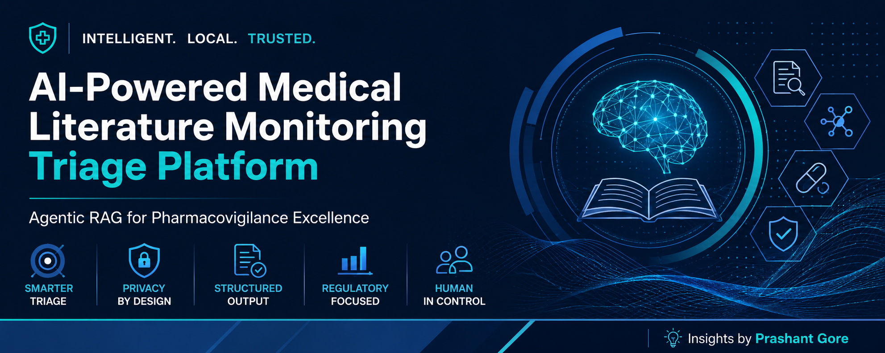

# AI-Powered Medical Literature Monitoring (MLM) Triage Platform for Pharmacovigilance

> **An Enterprise AI Solution Accelerator demonstrating Agentic Retrieval-Augmented Generation (RAG) for Medical Literature Monitoring in Pharmacovigilance.**

> **Status:** Portfolio Project • Functional Prototype • Local-First Architecture

---

<p align="center">
  
</p>

---


---

# Executive Summary

Medical Literature Monitoring (MLM) is a mandatory pharmacovigilance activity that requires continuous review of scientific literature to identify publications containing potential **Individual Case Safety Reports (ICSRs)**.

Safety professionals often review thousands of biomedical abstracts to identify a relatively small number of reportable safety cases. This process is repetitive, time-consuming, and requires consistent application of regulatory criteria.

This project demonstrates how **Agentic Retrieval-Augmented Generation (RAG)** can support the initial literature triage process by combining semantic retrieval with locally hosted Large Language Models (LLMs). Rather than replacing pharmacovigilance professionals, the solution assists reviewers by extracting structured safety information and producing an auditable assessment that can support downstream human review.

The platform has been developed as a **local-first AI solution**, ensuring that literature processing and inference remain within the local environment, an important consideration for privacy-conscious and regulated domains.

---

# Repository Highlights

### Business Perspective

- Addresses a real-world Pharmacovigilance workflow
- Demonstrates AI-assisted Medical Literature Monitoring
- Supports the identification of potential Individual Case Safety Reports (ICSRs)
- Produces structured, explainable outputs for reviewer assessment

### Technical Perspective

- Agentic Retrieval-Augmented Generation (RAG)
- Semantic vector search using ChromaDB
- Local LLM inference using Ollama
- LangChain-based orchestration
- Structured output validation using Pydantic
- Privacy-first local deployment

---

# Table of Contents

- Executive Summary
- Industry Challenge
- Solution Overview
- Business / Solution Architecture
- AI Processing Workflow
- Technical Architecture
- Technology Stack
- Repository Structure
- Current Capabilities
- Installation
- Usage
- Example Output
- Future Evolution
- References
- Disclaimer

---

# Industry Challenge

Medical Literature Monitoring (MLM) is a regulatory requirement established by global health authorities including the **U.S. Food and Drug Administration (FDA)** and the **European Medicines Agency (EMA)**. Marketing Authorization Holders (MAHs) are responsible for continuously monitoring published scientific literature to identify adverse events associated with medicinal products.

Although only a small proportion of published articles contain reportable safety information, every potentially relevant publication must be assessed against regulatory reporting criteria.

This creates several operational challenges:

- High manual review effort
- Large volumes of biomedical literature
- Low signal-to-noise ratio
- Time-intensive identification of valid ICSRs
- Need for consistent and reproducible assessments
- Requirement for auditability and traceability

As literature volumes continue to increase, AI-assisted decision support has the potential to improve reviewer productivity while maintaining transparency and human oversight.

---

# Solution Overview

The **AI-Powered Medical Literature Monitoring (MLM) Triage Platform for Pharmacovigilance** demonstrates how modern AI techniques can support the initial triage phase of Medical Literature Monitoring.

The solution combines semantic retrieval with a locally hosted Large Language Model to identify publications that may contain reportable safety information and extracts structured pharmacovigilance entities required for regulatory assessment.

### Current Workflow

1. Retrieve biomedical literature from PubMed.
2. Generate semantic embeddings.
3. Store documents in ChromaDB.
4. Retrieve relevant publications using semantic similarity search.
5. Analyze retrieved literature using a locally hosted LLM.
6. Extract key pharmacovigilance entities:
   - Identifiable Patient
   - Suspect Drug
   - Adverse Event
   - Identifiable Reporter
7. Produce a structured assessment suitable for downstream review.

The current implementation focuses on demonstrating how Retrieval-Augmented Generation (RAG) can augment the literature triage process while maintaining transparency, explainability, and local execution.

---

# Why This Project Matters

Artificial Intelligence is increasingly being adopted across regulated Life Sciences functions. However, successful adoption depends not only on model performance, but also on explainability, structured outputs, auditability, and alignment with established business processes.

This project was developed to demonstrate how AI can be integrated into a real pharmacovigilance workflow in a way that complements human expertise rather than replacing it. It combines domain knowledge with enterprise AI design principles to illustrate how Retrieval-Augmented Generation (RAG) can support safer, more efficient literature triage in regulated environments.

---

# Business / Solution Architecture

The solution has been designed around the business workflow followed during Medical Literature Monitoring (MLM). Rather than focusing on implementation details, this view illustrates how AI capabilities support the pharmacovigilance literature triage process.

<p align="center">
  
</p>

---

## Business Capability Flow

| Capability | Purpose |
|------------|---------|
| Literature Acquisition | Retrieve biomedical publications from PubMed |
| Semantic Knowledge Layer | Transform literature into searchable embeddings |
| AI Triage Engine | Analyze retrieved publications using an LLM |
| Clinical Safety Assessment | Extract structured pharmacovigilance entities |
| Structured Regulatory Output | Produce an auditable ICSR assessment |

---

# AI Processing Workflow

The current implementation follows an **Agentic Retrieval-Augmented Generation (RAG)** workflow that combines semantic search with local LLM reasoning.

<p align="center">
  
</p>

---

## End-to-End Workflow

1. Biomedical literature is retrieved from PubMed.
2. Literature is converted into semantic embeddings.
3. Embeddings are indexed in ChromaDB.
4. User queries are converted into vector representations.
5. Similar publications are retrieved using semantic similarity search.
6. Retrieved context is provided to the local LLM.
7. The LLM extracts structured pharmacovigilance entities.
8. Results are exported as a structured CSV for downstream review.

---

# Technical Component Architecture

The following architecture illustrates how the application's software components interact.

<p align="center">
  
</p>

---

# Technology Stack

| Architecture Layer | Technology | Purpose |
|--------------------|------------|---------|
| Programming Language | Python | Workflow orchestration |
| AI Framework | LangChain | LLM orchestration |
| Embedding Model | mxbai-embed-large | Semantic vector generation |
| Vector Database | ChromaDB | Knowledge retrieval |
| Retrieval Strategy | Semantic Similarity Search | Context retrieval |
| Large Language Model | Llama 3.2 (Ollama) | Clinical reasoning |
| Structured Output | Pydantic | Data validation |
| Data Source | PubMed | Biomedical literature |
| Output | CSV | Regulatory audit trail |

---

## Detailed Architecture Documentation

For a deeper explanation of the solution architecture, technical components, workflow, and design decisions, see:

📄 [Architecture Documentation](docs/architecture.md)

---
# Repository Structure

```text
mlm-triage-agent/

│
├── README.md
│
├── docs/
│   └── architecture.md
│
├── assets/
│   ├── banner.png
│   ├── solution_architecture.svg
│   ├── ai_workflow.svg
│   └── technical_architecture.svg
│
├── chroma_mlm_db/
│
├── mlm_agent_core.py
│
├── requirements.txt
│
└── LICENSE
```

---

# Current Capabilities

The current implementation demonstrates the following capabilities:

### Business

- AI-assisted Medical Literature Monitoring
- Initial literature triage
- Structured ICSR assessment
- Regulatory-focused workflow

### Technical

- Agentic Retrieval-Augmented Generation (RAG)
- Local LLM inference
- Semantic vector retrieval
- ChromaDB knowledge base
- Structured output validation
- CSV audit generation
- Privacy-first local execution

---

# Installation

## Prerequisites

Ensure the following software is installed before running the application:

- Python 3.11 or later
- Ollama
- Git

Ensure that the Ollama service is installed and running before downloading the required models.

Download the required local models:

```bash
ollama pull mxbai-embed-large
ollama pull llama3.2
```

Clone the repository:

```bash
git clone https://github.com/PrashantRGore/mlm-triage-agent.git

cd mlm-triage-agent
```

Install project dependencies:

```bash
pip install -r requirements.txt
```

---

# Running the Application

Execute the main workflow:

```bash
python mlm_agent_core.py
```

The application will:

- Retrieve biomedical literature
- Generate semantic embeddings
- Store vectors in ChromaDB
- Retrieve relevant publications
- Analyze literature using the local LLM
- Produce structured pharmacovigilance outputs
- Export results to CSV

---

# Example Output

The generated audit file contains structured pharmacovigilance information including:

| Field | Description |
|--------|-------------|
| PMID | PubMed identifier |
| Article Title | Biomedical publication title |
| Identifiable Patient | Patient information extracted by the LLM |
| Suspect Drug | Drug associated with the reported event |
| Adverse Event | Clinical event identified from the literature |
| Identifiable Reporter | Reporter information when available |
| Valid ICSR | Initial AI-assisted assessment |
| Clinical Rationale | Explanation supporting the decision |
| Timestamp | Processing timestamp |

This structured output is intended to support downstream human review and auditability.

---

# Current Limitations

This repository represents a functional prototype designed to demonstrate the application of Agentic Retrieval-Augmented Generation (RAG) to Medical Literature Monitoring.

The current implementation intentionally focuses on a simplified workflow.

Current limitations include:

- Abstract-level literature processing
- Local execution only
- Single-agent workflow
- CSV-based output
- Limited prompt optimization
- No confidence scoring
- No human review interface
- No production deployment configuration

These limitations are acknowledged and provide opportunities for future enhancement.

---

# Future Enhancements

The following enhancements represent logical next steps for evolving the solution while maintaining alignment with regulated pharmacovigilance workflows.

## AI Capabilities

- Confidence scoring for extracted entities
- Human-in-the-loop review workflow
- Prompt optimization and evaluation
- Improved reasoning strategies
- Multi-document evidence aggregation

## Data Processing

- Full-text PDF processing
- Additional biomedical literature sources
- Automated literature ingestion pipelines
- Incremental vector database updates

## User Experience

- Interactive Streamlit dashboard
- Case review interface
- Search and filtering capabilities
- Visual analytics

## Enterprise Readiness

- Modular project architecture
- Comprehensive logging
- Automated testing
- Configuration management
- Containerization
- CI/CD pipeline

---

# Learning Outcomes

This project provided practical experience in applying modern AI techniques to a regulated Life Sciences use case.

Key areas explored include:

- Retrieval-Augmented Generation (RAG)
- Semantic vector search
- Local Large Language Models
- AI-assisted decision support
- Prompt engineering
- Structured output generation
- Pharmacovigilance workflow analysis
- Enterprise AI solution design

---

# References

The following resources were referenced while designing and implementing this project:

## Regulatory Guidance

- [U.S. Food and Drug Administration (FDA) – Pharmacovigilance Guidance](https://www.fda.gov/drugs/surveillance/fda-adverse-event-reporting-system-faers)
- [European Medicines Agency (EMA) – Pharmacovigilance](https://www.ema.europa.eu/en/human-regulatory-overview/post-authorisation/pharmacovigilance-overview)

## Biomedical Literature

- [PubMed](https://pubmed.ncbi.nlm.nih.gov/)

## AI & Development Frameworks

- [LangChain Documentation](https://python.langchain.com/)
- [Ollama Documentation](https://ollama.com/docs)
- [ChromaDB Documentation](https://docs.trychroma.com/)
- [Pydantic Documentation](https://docs.pydantic.dev/)

## AI Models

- [Llama 3.2 Model Library (Ollama)](https://ollama.com/library/llama3.2)
- [mxbai-embed-large Embedding Model (Ollama)](https://ollama.com/library/mxbai-embed-large)

---

# Acknowledgements

This repository was developed as part of my continuous learning journey in applying Artificial Intelligence to Life Sciences and Pharmacovigilance.

It combines my professional background in Pharmacovigilance with hands-on exploration of AI engineering, Retrieval-Augmented Generation (RAG), and enterprise solution design.

---

# About the Author

## Prashant Gore

Life Sciences Business Analyst | Pharmacovigilance Professional | AI & Digital Transformation Enthusiast

With over a decade of experience in Pharmacovigilance, I am passionate about bridging domain expertise with Artificial Intelligence to design practical, explainable, and business-focused solutions for regulated healthcare environments.

This repository reflects my ongoing journey toward building enterprise AI solutions that combine Life Sciences knowledge, Business Analysis, and emerging AI technologies.

---

# Connect With Me

If you would like to discuss Pharmacovigilance, AI, Business Analysis, or Digital Transformation, feel free to connect.

- GitHub: https://github.com/PrashantRGore/mlm-triage-agent
- LinkedIn: https://www.linkedin.com/in/prashantgorepg/

---

# Disclaimer

This project has been developed for educational and portfolio purposes to demonstrate the application of Agentic Retrieval-Augmented Generation (RAG) within the context of Medical Literature Monitoring.

It is **not** intended for production use and has **not** been validated for regulatory decision-making.

Any outputs generated by this application should be reviewed by qualified Pharmacovigilance professionals before being used in operational or regulatory contexts.

---

## If you found this repository useful...

If you found this project valuable, consider starring the repository and connecting with me to discuss AI applications in Pharmacovigilance, Business Analysis, and Digital Transformation.

Constructive feedback, suggestions, and discussions are always welcome.

Together, we can continue exploring how responsible AI can support safer and more efficient pharmacovigilance processes.
