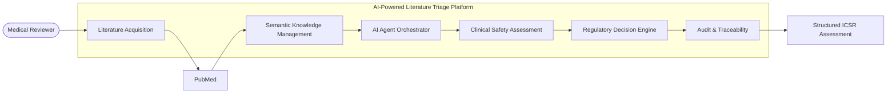
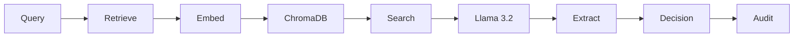
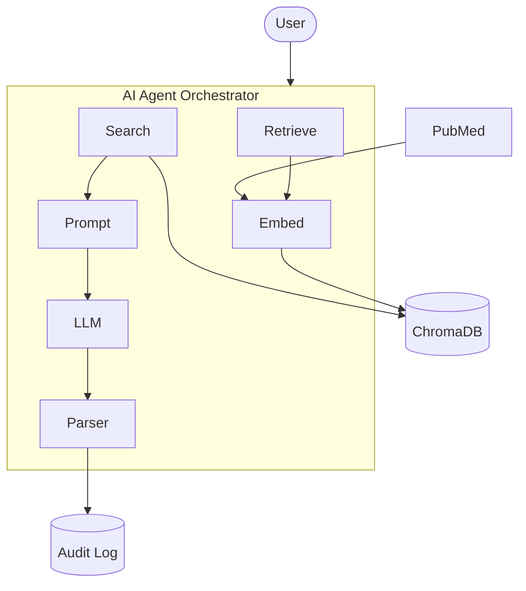

# 🤖 AI-Powered Medical Literature Monitoring (MLM) Triage Platform

> **Agentic Retrieval-Augmented Generation (RAG) for Pharmacovigilance Medical Literature Monitoring**


---

## Executive Summary

This project demonstrates how **Agentic AI**, **Retrieval-Augmented Generation (RAG)**, **semantic vector search**, and **locally hosted Large Language Models (LLMs)** can automate the initial triage stage of **Medical Literature Monitoring (MLM)** for Pharmacovigilance.

The solution retrieves biomedical literature from PubMed, stores it in a semantic vector database, retrieves relevant publications through similarity search, and uses a locally hosted LLM to produce structured pharmacovigilance decisions with an auditable output.

---

## Business Problem

Medical Literature Monitoring is a mandatory pharmacovigilance activity required by regulators such as the FDA and EMA. Safety teams manually review thousands of scientific publications to identify potential Individual Case Safety Reports (ICSRs).

Challenges include:

- High manual effort
- Low signal-to-noise ratio
- Repetitive literature screening
- Need for consistent regulatory decisions
- Auditability and traceability

---

## Solution Overview

The platform:

1. Retrieves literature from PubMed.
2. Generates vector embeddings.
3. Stores documents in ChromaDB.
4. Performs semantic similarity search.
5. Uses an AI Agent to assess literature.
6. Extracts structured safety entities.
7. Produces an auditable ICSR assessment.

---

# Solution Architecture



---

# AI Workflow



---

# Technical Architecture



---

## Technology Stack

| Layer | Technology |
|---|---|
| Language | Python |
| AI Framework | LangChain |
| LLM | Llama 3.2 (Ollama) |
| Embeddings | mxbai-embed-large |
| Vector Database | ChromaDB |
| Literature Source | PubMed |
| Validation | Pydantic |

---

## Project Structure

```text
mlm-triage-agent/
├── mlm_agent_core.py
├── requirements.txt
├── chroma_mlm_db/
└── README.md
```

---

## Installation

```bash
git clone https://github.com/PrashantRGore/mlm-triage-agent.git
cd mlm-triage-agent

ollama pull mxbai-embed-large
ollama pull llama3.2

pip install -r requirements.txt

python mlm_agent_core.py
```

---

## Example Output

The generated audit log contains:

- PubMed ID
- Article Title
- Patient Details
- Suspect Drug
- Adverse Event
- Valid ICSR
- Clinical Rationale
- Timestamp

---

## Current Capabilities

- Agentic AI workflow
- Retrieval-Augmented Generation (RAG)
- Semantic retrieval
- Local LLM inference
- Structured outputs
- Regulatory audit logging
- Privacy-first architecture

---

## Future Roadmap

- Human-in-the-loop review
- Confidence scoring
- Multi-agent workflow
- PDF full-text ingestion
- Knowledge Graph integration
- Power BI dashboard

---

## Disclaimer

This repository is a portfolio and learning project demonstrating AI techniques for Medical Literature Monitoring. It is **not validated for production use** in regulated pharmacovigilance environments.

---

**Author:** Prashant Gore

*AI • Pharmacovigilance • Life Sciences Digital Transformation*
